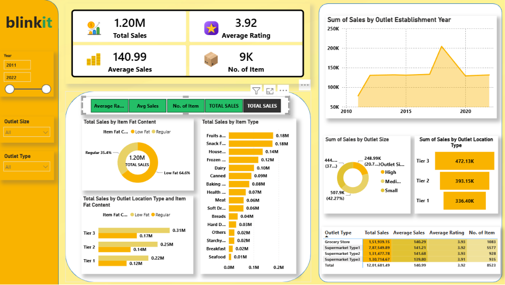

# 🛒 Blinkit Sales Dashboard | Power BI

## 📌 Project Overview
This project is an interactive Power BI dashboard developed to analyze Blinkit's sales performance, customer preferences, and outlet performance. It provides meaningful business insights through dynamic visualizations, KPIs, and interactive slicers to support data-driven decision-making.
---
## 🎯 Objective
- Analyze overall sales performance.
- Compare sales across outlet locations and sizes.
- Identify top-performing item categories.
- Track customer ratings and product trends.
- Provide an interactive dashboard for business analysis.
---
## 🛠️ Tools & Technologies
- Microsoft Power BI
- Power Query
- DAX (Data Analysis Expressions)
- Microsoft Excel
---
## 📊 Key KPIs
- 💰 Total Sales
- 📦 Number of Items
- ⭐ Average Rating
- 💵 Average Sales
---
## 📈 Dashboard Features
- Sales by Item Type
- Sales by Fat Content
- Sales by Outlet Size
- Sales by Outlet Location
- Outlet Establishment Trend
- Interactive Filters (Slicers)
- KPI Cards
- Dynamic Charts
---
## 📂 Dataset
The dashboard is built using the Blinkit sales dataset in Microsoft Excel.
---
## 📷 Dashboard Preview

---
## 📁 Files Included
- Blinkit data.pbix
- Blinkit Sales data.xlsx
- Dashboard Screenshot.png
---
## 💡 Key Insights
- Identified the highest-performing outlet locations.
- Compared sales across different outlet sizes.
- Analyzed customer ratings and product categories.
- Built an interactive dashboard for quick business analysis.
---
## 👩‍💻 Created By
**Naysha Sharma**  
Aspiring Data Analyst | Excel | Power BI
